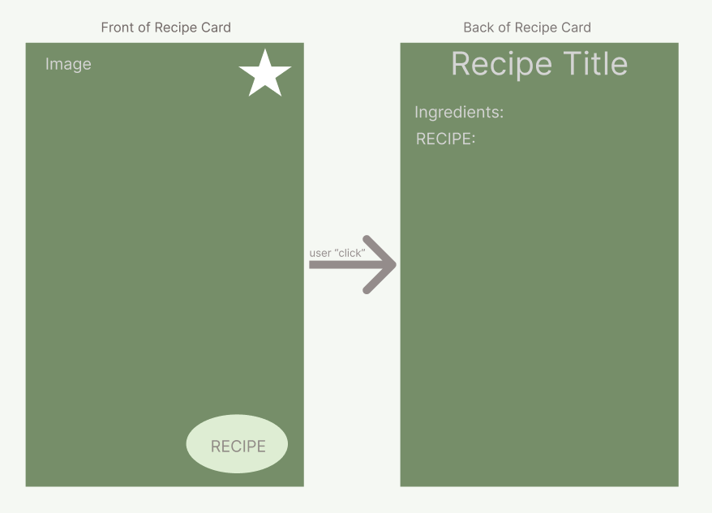
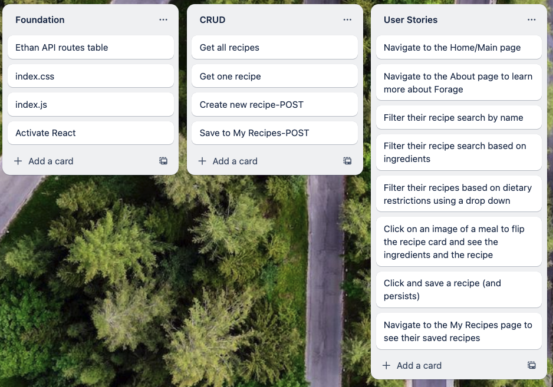

# 
Phase 2 Project: FORAGE

# Forage
 A one stop shop for meal inspo when you don’t know what to make with what’s left in your fridge. *dietary restriction friendly 

## [Github] (https://github.com/vcali02/Forage/edit/main/README.md)

---

## Wireframe:

Home Page

Add a Recipe Form

Recipe Card

---

## User story:

- Users will be able to…
1. Navigate to the Home/Main page
2. Navigate to the About page to learn more about Forage
3. Filter their recipe search by name
4. Filter their recipe search based on ingredients
5. Filter their recipes based on dietary restrictions using a drop down
6. Click on an image of a meal to flip the recipe card and see the ingredients and the recipe
7. Click and favorite a recipe (and persists)
8. Navigate to the Favorites page to see their saved favorites

---

## Information Flow Diagram:

---

## API Routes:

| API Route                                         | Request Method | Body              | Response             |
|---------------------------------------------------|----------------|-------------------|----------------------|
| https://api.edamam.com/api/recipes/v2?type=public | GET            |                   | [{...},{...},{...}]  |
| localhost/myrecipes                               | POST           | {`recipe object`} | {`id, recipe object`}|
| localhost/myrecipes                               | GET            |                   | [{...},{...},{...}]  |
| localhost/myrecipes/id                            | DELETE         |                   | {}                   |

---

## Client Side Routes:

| Client Route | Component     |
|--------------|---------------|
| /            | RecipeList.js |
| /home        | RecipeList.js |
| /search      | Search.js     |
| /about       | About.js      |
| /new         | AddRecipe.js  |

---

## Trello:

